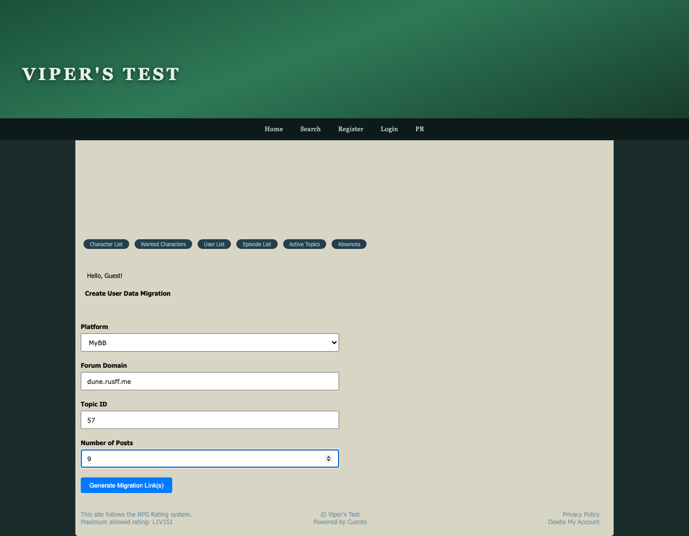
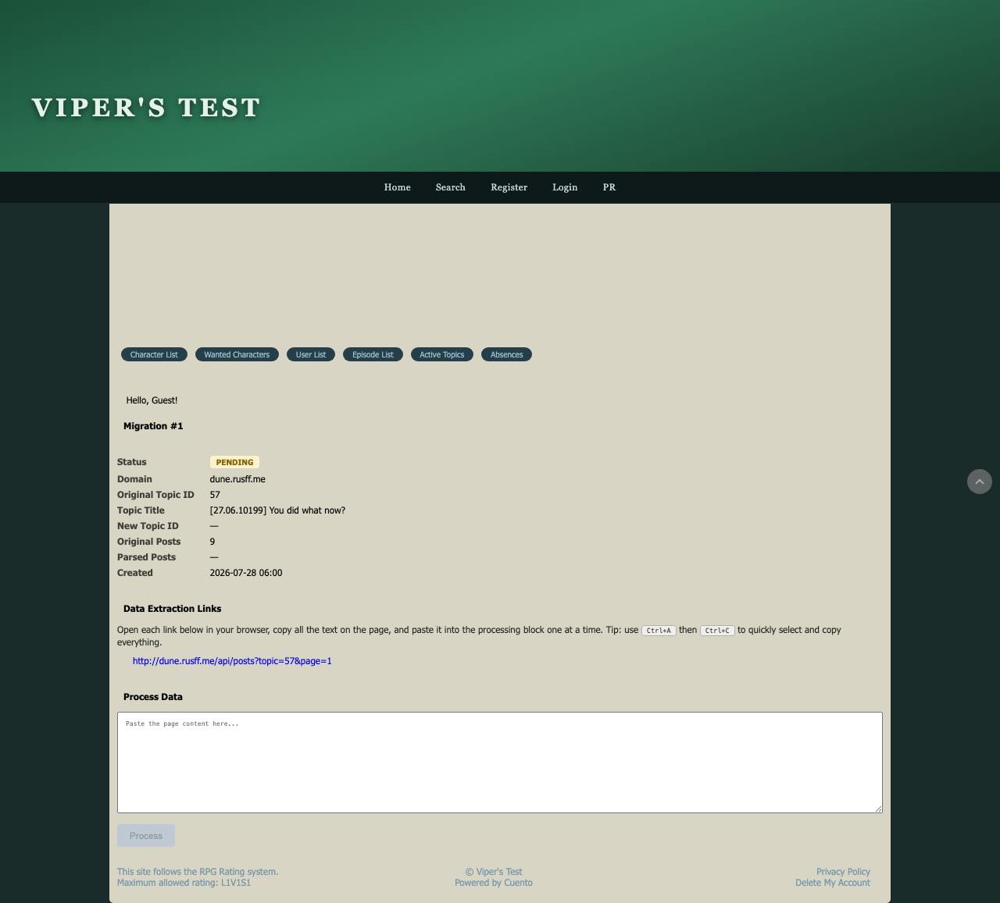
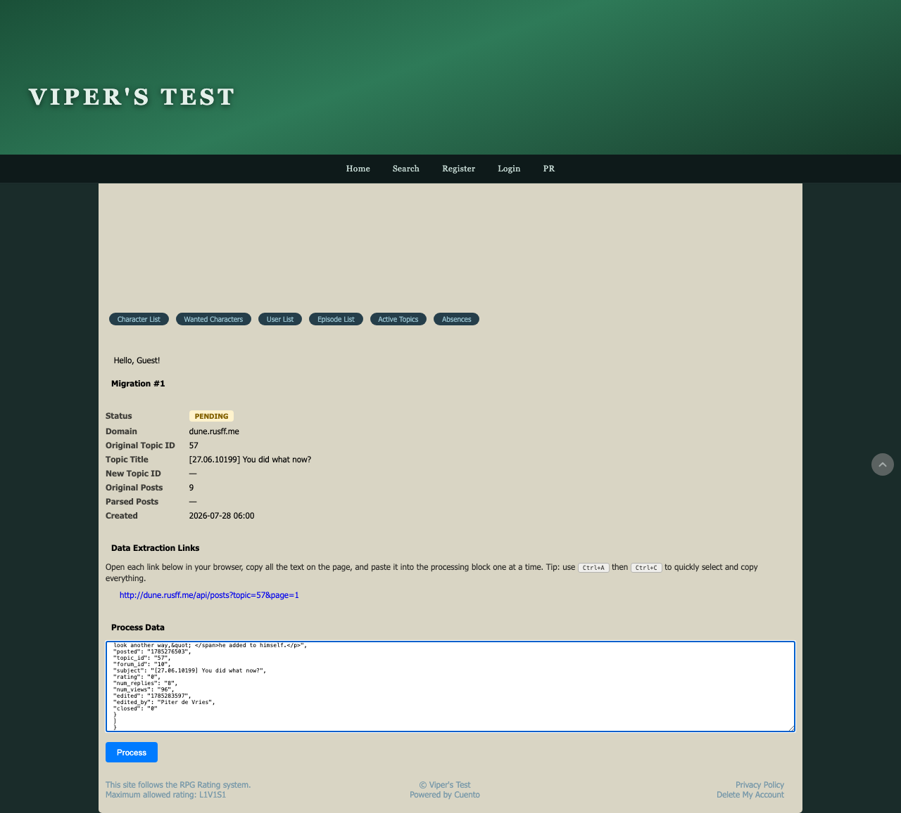
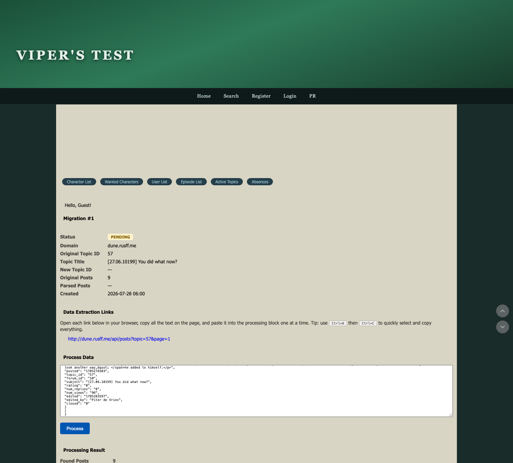

# User Data Migrations

The User Data Migrations feature lets you bring an existing roleplay episode from another platform (currently MyBB-based forums) into Cuento. The module fetches the original posts, lets you match each old username to a character on your forum, and then publishes the full thread as a new episode — preserving authorship, order, and content.

Any participant of the target episode can run the migration. The process takes a few minutes and requires no technical knowledge beyond being able to open a link and copy-paste text.

## How to use User Data Migrations

### Step 1 — Prepare the episode on your forum

Before starting a migration, create the destination episode on your Cuento forum and add every character who wrote posts in the original thread to it. **If any participating character is missing, the migration cannot complete** — add them to the episode first, then come back.

### Step 2 — Fill in the migration form

Navigate to **Create User Data Migration**. You will see a short form with four fields:

- **Platform** — currently only MyBB is supported; leave it as-is.
- **Forum Domain** — the domain of the source forum, without `http://` and without a trailing slash (e.g. `dune.rusff.me`).
- **Topic ID** — open the original thread in your browser and look at the URL for `?id=57` or `topic=57`; enter that number.
- **Number of Posts** — the total post count shown on the original thread. The module is smart enough to adjust if you are off by one (the header post is sometimes counted separately, so don't worry about whether to include it).

Click **Generate Migration Link(s)** when all fields are filled.

---

### Step 3 — Review the migration page and open the extraction link

After submitting, you are taken to the migration detail page. It shows the migration status (initially **Pending**), the domain and topic ID you entered, the title of the original thread, and a **Data Extraction Links** section with one or more clickable URLs.

Open each link in a new browser tab. The page will display raw JSON — that is the post data exported from the source forum.

---

### Step 4 — Copy and paste the extracted data

On the extraction link page, press **Ctrl + A** to select all the text, then **Ctrl + C** to copy it.

Return to the migration page and paste the copied content into the **Process Data** textarea. If the source thread spans multiple pages and you received more than one extraction link, process them one at a time: paste the first page's content, click **Process**, wait for the result, then repeat for each subsequent link.

Click **Process** to send the data to the server.

---

### Step 5 — Map original users to characters, then publish

After processing completes, the page shows a **Processing Result** summary — how many posts were found, any duplicates skipped, and whether all posts were parsed — followed by a **User Mapping** table.

In the table, each username from the original forum appears in the left column. Use the **Search character...** field in the right column to find and select the matching character on your Cuento forum. Do this for every row. The **Update Mapping** button stays disabled until every user has been assigned a character.

Once the mapping is saved, the **Publish** section becomes available at the bottom of the page. Select the destination episode and click **Publish**. The posts are created in the episode in their original order.

---

## Notes

- **Prepare all characters first.** If you realise mid-migration that a character is missing from the episode, add them on the forum and then return to complete the mapping.
- The post count can be off by one — the module detects and adjusts for the difference between including or excluding the opening header post.
- For threads spread across multiple pages, you will receive one extraction link per page. Paste and process each page in order before publishing.
- Once a migration is published its status changes to **Published** and cannot be run again for that same migration record.
